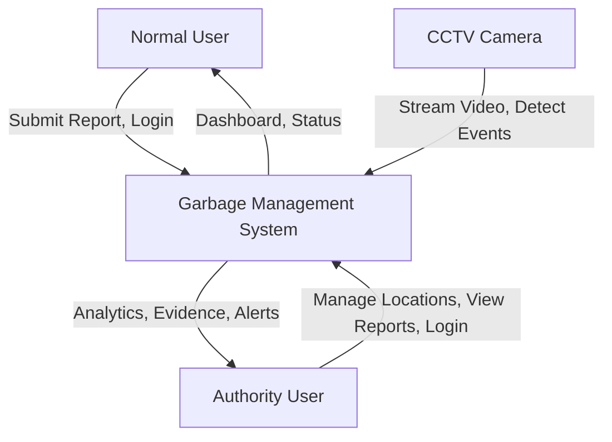
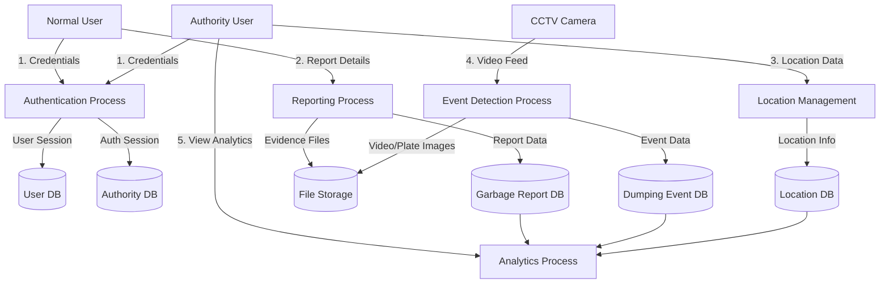
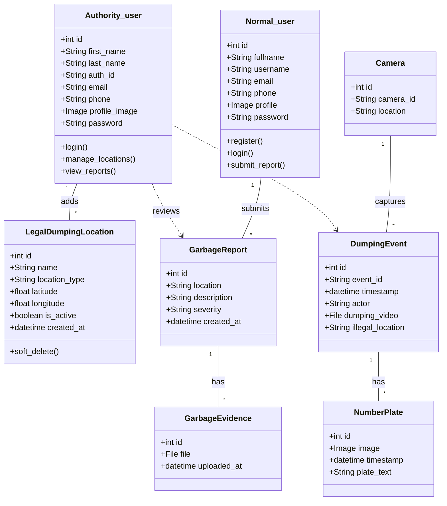
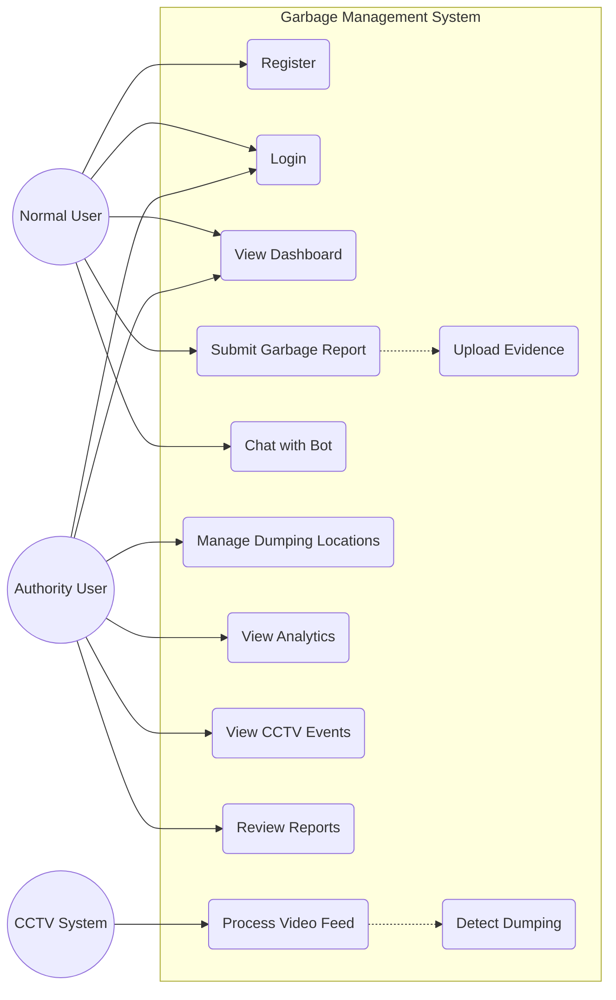
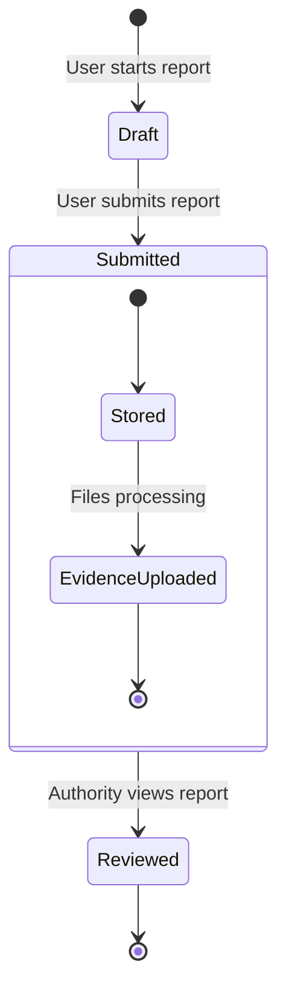
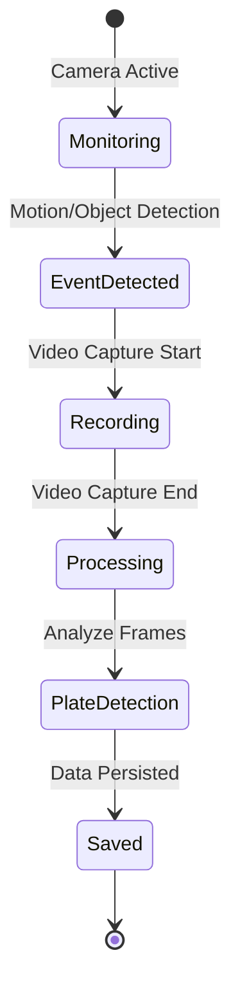

# System Design Diagrams

## 1. Data Flow Diagram (DFD)

### Level 0 (Context Diagram)

### Level 1 DFD

## 2. UML Class Diagram

## 3. UML Use Case Diagram

## 4. UML State Chart Diagram (Report Lifecycle)

## 5. UML State Chart Diagram (Dumping Event)

